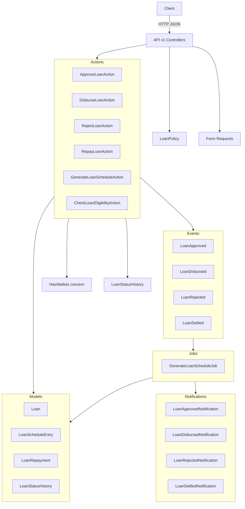

# Design Document: Loan Management System

## Overview

A backend loan management system built on Laravel 13 / PHP 8.4. Users apply for loans, which are evaluated against pluggable eligibility specifications at application time, progress through a defined status lifecycle (`active → approved → disbursed`, or `active/approved → rejected`), generate amortisation schedules on disbursement using either flat-rate or reducing-balance interest methods, and accept full or partial repayments via the existing `HasWallets` concern. Every status transition is recorded in an audit history. All functionality is exposed through a versioned JSON REST API under `/api/v1/`, protected by a `LoanPolicy` and rate limiting on the application endpoint.

The design follows the open/closed principle: new eligibility rules are added by implementing `LoanSpecification` and registering the implementation in the service container — no changes to `LoanEligibilityChecker` or any action class are required.

---

## Architecture



### Request Lifecycle

1. Controller receives request, delegates to a Form Request for validation.
2. Controller authorizes the request via `LoanPolicy` (returns 403 if unauthorized).
3. Controller calls the relevant Action class.
4. Action updates the Loan model, records a `LoanStatusHistory` entry, calls wallet methods if needed, and fires an event.
5. Event listeners dispatch queued jobs for schedule generation; named notification classes are dispatched directly.
6. Controller returns an Eloquent API Resource.

---

## Components and Interfaces

### LoanSpecification Interface

```php
interface LoanSpecification
{
    public function isSatisfiedBy(User $user): bool;
    public function failureReason(): string;
}
```

Implementations are bound in `AppServiceProvider` and injected as `array<LoanSpecification>` into `LoanEligibilityChecker`.

**Implementations:**
- `UserDurationSpecification` — passes when `now()->diffInDays($user->created_at) >= config('loans.min_account_age_days')`.
- `LoanLevelSpecification` — passes when the requested amount does not exceed the user's loan level limit.

### LoanEligibilityChecker

```php
class LoanEligibilityChecker
{
    public function __construct(private array $specifications) {}

    public function check(User $user): EligibilityResult;
}
```

`EligibilityResult` is a value object: `{ passed: bool, failingSpecification: ?LoanSpecification }`.

### CheckLoanEligibilityAction

Runs `LoanEligibilityChecker` against the authenticated user and returns an `EligibilityResult`. Called by `StoreLoanRequest` (or the controller) before persisting a loan, and directly by `LoanEligibilityController`. When the result is a failure, the action throws a `LoanIneligibleException` (422) without persisting any loan record. On success it stamps `eligibility_checked_at` and `eligibility_passed = true` onto the loan.

### LoanPolicy

```php
// App\Policies\LoanPolicy
class LoanPolicy
{
    public function viewAny(User $user): bool;
    public function create(User $user): bool;
    public function approve(User $user, Loan $loan): bool;
    public function disburse(User $user, Loan $loan): bool;
    public function reject(User $user, Loan $loan): bool;
}
```

Registered in `AppServiceProvider` (or via `#[Policy]` attribute). Applied in every loan controller via `$this->authorize()`. Unauthorized requests receive HTTP 403.

### Action Classes

Each action is a single-purpose class injected via the service container.

| Class | Responsibility |
|---|---|
| `ApproveLoanAction` | Validates `active` status, transitions to `approved`, records `LoanStatusHistory`, fires `LoanApproved`, dispatches `LoanApprovedNotification` |
| `DisburseLoanAction` | Validates `approved` status, deposits principal to wallet, transitions to `disbursed`, records `LoanStatusHistory`, fires `LoanDisbursed`, dispatches `LoanDisbursedNotification` |
| `RejectLoanAction` | Validates `active`/`approved` status, requires `rejection_reason`, transitions to `rejected`, records `LoanStatusHistory`, fires `LoanRejected`, dispatches `LoanRejectedNotification` |
| `RepayLoanAction` | Validates `disbursed` status, guards against overpayment (422), withdraws from wallet, creates `LoanRepayment`, reduces `remaining_amount` on current entry, transitions entry to `Paid` when `remaining_amount` reaches 0, updates outstanding balance, fires `LoanSettled` if balance reaches zero, dispatches `LoanSettledNotification` |
| `GenerateLoanScheduleAction` | Branches on `InterestMethod`; calculates flat-rate or reducing-balance schedule, bulk-inserts `LoanScheduleEntry` records with `status = Pending` |
| `CheckLoanEligibilityAction` | Runs `LoanEligibilityChecker`, returns `EligibilityResult`, stamps `eligibility_checked_at` / `eligibility_passed` on the loan |

### Controllers

All controllers live under `App\Http\Controllers\Api\V1\` and extend the base `Controller`.

- `LoanController` — `index` (paginated, 15/page), `store`, `show`
- `LoanScheduleController` — `index` (scoped to loan)
- `LoanRepaymentController` — `store` (scoped to loan)
- `LoanApprovalController` — `store` (approve action)
- `LoanDisbursementController` — `store` (disburse action)
- `LoanRejectionController` — `store` (reject action)
- `LoanEligibilityController` — `store` (pre-check, no loan created)

### Routes

```php
// routes/api.php  (prefix: api/v1)
Route::middleware('auth:sanctum')->prefix('v1')->group(function () {
    // Rate-limited loan application
    Route::middleware(
        RateLimiter::for('loan-applications', fn (Request $r) => Limit::perMinute(5)->by($r->user()->id))
    )->post('loans', [LoanController::class, 'store']);

    Route::get('loans',          [LoanController::class, 'index']);
    Route::get('loans/{loan}',   [LoanController::class, 'show']);

    Route::post('loans/eligibility',          [LoanEligibilityController::class, 'store']);
    Route::get('loans/{loan}/schedule',       [LoanScheduleController::class, 'index']);
    Route::post('loans/{loan}/repayments',    [LoanRepaymentController::class, 'store']);
    Route::post('loans/{loan}/approve',       [LoanApprovalController::class, 'store']);
    Route::post('loans/{loan}/disburse',      [LoanDisbursementController::class, 'store']);
    Route::post('loans/{loan}/reject',        [LoanRejectionController::class, 'store']);
});
```

The `loan-applications` rate limiter is registered in `AppServiceProvider::boot()`:

```php
RateLimiter::for('loan-applications', function (Request $request) {
    return Limit::perMinute(5)->by($request->user()?->id ?: $request->ip());
});
```

### API Resources

- `LoanResource` — wraps `Loan` model
- `LoanScheduleResource` — wraps `LoanScheduleEntry`
- `LoanRepaymentResource` — wraps `LoanRepayment`

`LoanController::index` returns `LoanResource::collection($loans->paginate(15))`.

### Form Requests

- `StoreLoanRequest` — validates `principal_amount` (numeric, min:1), `repayment_term_months` (integer, min:1), and optional `interest_method` (in: `FlatRate`, `ReducingBalance`; defaults to `FlatRate`). Triggers `CheckLoanEligibilityAction` before the controller persists the loan.
- `StoreRepaymentRequest` — validates `amount` (numeric, min:0.01, max: loan's `outstanding_balance`).
- `StoreRejectionRequest` — validates `rejection_reason` (required, string).

### Notifications

All notification classes live under `App\Notifications\Loans\` and implement `ShouldQueue` + use `Queueable`.

| Class | Trigger |
|---|---|
| `LoanApprovedNotification` | Loan transitions to `approved` |
| `LoanDisbursedNotification` | Loan transitions to `disbursed` |
| `LoanRejectedNotification` | Loan transitions to `rejected` |
| `LoanSettledNotification` | Loan outstanding balance reaches zero |

---

## Data Models

### loans

| Column | Type | Notes |
|---|---|---|
| `id` | bigint PK | |
| `user_id` | bigint FK | `users.id` |
| `principal_amount` | decimal(15,2) | Original loan amount |
| `outstanding_balance` | decimal(15,2) | Decremented on repayment |
| `interest_rate` | decimal(5,4) | e.g. 0.1500 = 15% |
| `repayment_term_months` | unsignedInteger | Number of monthly instalments |
| `interest_method` | string | Enum: `FlatRate`, `ReducingBalance`; default `FlatRate` |
| `status` | string | Enum: `active`, `approved`, `disbursed`, `rejected` |
| `disbursed_at` | timestamp nullable | Set on disbursement |
| `eligibility_checked_at` | timestamp nullable | Set when eligibility check runs |
| `eligibility_passed` | boolean nullable | Result of eligibility check |
| `notes` | text nullable | Optional administrator context |
| `rejection_reason` | text nullable | Required when status transitions to `rejected` |
| `created_at` / `updated_at` | timestamps | |

### loan_schedule_entries

| Column | Type | Notes |
|---|---|---|
| `id` | bigint PK | |
| `loan_id` | bigint FK | `loans.id` |
| `instalment_number` | unsignedInteger | 1-based sequence |
| `due_date` | date | Monthly from disbursement date |
| `instalment_amount` | decimal(15,2) | Fixed monthly payment |
| `principal_component` | decimal(15,2) | |
| `interest_component` | decimal(15,2) | |
| `outstanding_balance` | decimal(15,2) | Balance after this payment |
| `status` | string | `LoanScheduleEntryStatus` enum: `Pending`, `Paid`, `Overdue` |
| `remaining_amount` | decimal(15,2) | Tracks partial payment progress; starts equal to `instalment_amount` |
| `paid_at` | timestamp nullable | Set when entry transitions to `Paid` |
| `created_at` / `updated_at` | timestamps | |

### loan_repayments

| Column | Type | Notes |
|---|---|---|
| `id` | bigint PK | |
| `loan_id` | bigint FK | `loans.id` |
| `amount` | decimal(15,2) | |
| `transaction_id` | bigint FK nullable | `transactions.id` |
| `created_at` / `updated_at` | timestamps | |

### loan_status_histories

| Column | Type | Notes |
|---|---|---|
| `id` | bigint PK | |
| `loan_id` | bigint FK | `loans.id` |
| `from_status` | string nullable | `null` for the initial creation record |
| `to_status` | string | Target `LoanStatus` value |
| `actor_user_id` | bigint FK | `users.id` — user who triggered the transition |
| `notes` | text nullable | Optional context copied from the loan action |
| `created_at` | timestamp | Transition timestamp (no `updated_at`) |

### Eloquent Models

```
App\Models\Loan
App\Models\LoanScheduleEntry
App\Models\LoanRepayment
App\Models\LoanStatusHistory
```

`Loan` has:
- `belongsTo(User::class)`
- `hasMany(LoanScheduleEntry::class)`
- `hasMany(LoanRepayment::class)`
- `hasMany(LoanStatusHistory::class)`
- `LoanStatus` enum cast on `status`
- `InterestMethod` enum cast on `interest_method`

`LoanStatusHistory` has:
- `belongsTo(Loan::class)`
- `belongsTo(User::class, 'actor_user_id')`

`LoanScheduleEntry` has:
- `LoanScheduleEntryStatus` enum cast on `status`

### LoanStatus Enum

```php
enum LoanStatus: string
{
    case Active    = 'active';
    case Approved  = 'approved';
    case Disbursed = 'disbursed';
    case Rejected  = 'rejected';
}
```

### InterestMethod Enum

```php
enum InterestMethod: string
{
    case FlatRate        = 'FlatRate';
    case ReducingBalance = 'ReducingBalance';
}
```

### LoanScheduleEntryStatus Enum

```php
enum LoanScheduleEntryStatus: string
{
    case Pending = 'Pending';
    case Paid    = 'Paid';
    case Overdue = 'Overdue';
}
```

### Schedule Calculation

**Flat-rate (add-on) interest** (`InterestMethod::FlatRate`):

```
total_interest      = principal × rate × (term / 12)
total_repayable     = principal + total_interest
instalment_amount   = total_repayable / term
interest_component  = total_interest / term
principal_component = principal / term
```

Outstanding balance after instalment `n` = `principal - (principal_component × n)`.

**Reducing-balance (amortisation)** (`InterestMethod::ReducingBalance`):

```
monthly_rate      = annual_rate / 12
instalment_amount = principal × monthly_rate / (1 - (1 + monthly_rate)^(-term))

For each period n:
  interest_component  = outstanding_balance_before × monthly_rate
  principal_component = instalment_amount - interest_component
  outstanding_balance = outstanding_balance_before - principal_component
```

`GenerateLoanScheduleAction` branches on `$loan->interest_method` to select the appropriate formula.

---

## Correctness Properties

*A property is a characteristic or behavior that should hold true across all valid executions of a system — essentially, a formal statement about what the system should do. Properties serve as the bridge between human-readable specifications and machine-verifiable correctness guarantees.*

### Property 1: Loan application persists with active status

*For any* valid principal amount and repayment term submitted by an authenticated user, the resulting loan record SHALL have status `active` and its `user_id` SHALL equal the authenticated user's id.

**Validates: Requirements 1.1, 1.5**

---

### Property 2: Invalid loan application inputs return 422

*For any* loan application request where the principal amount is missing, zero, negative, or non-numeric, OR where the repayment term is missing, zero, negative, or non-integer, the API SHALL return HTTP 422.

**Validates: Requirements 1.3, 1.4**

---

### Property 3: Eligibility checker result matches specification outcomes

*For any* set of `LoanSpecification` instances and any user, the `LoanEligibilityChecker` SHALL return `true` if and only if every specification returns `true` for that user, and SHALL return `false` (with the first failing specification identified) if any specification returns `false`.

**Validates: Requirements 2.2, 2.3, 2.4**

---

### Property 4: UserDurationSpecification passes iff account age meets threshold

*For any* user and any configured minimum account age in days, `UserDurationSpecification::isSatisfiedBy()` SHALL return `true` if and only if the user's account age in days is greater than or equal to the configured minimum.

**Validates: Requirements 2.5**

---

### Property 5: LoanLevelSpecification passes iff amount is within level limit

*For any* user loan level and any requested amount, `LoanLevelSpecification::isSatisfiedBy()` SHALL return `true` if and only if the requested amount does not exceed the limit for that level.

**Validates: Requirements 2.6**

---

### Property 6: Loan status transitions are enforced

*For any* loan, the following SHALL hold:
- Approving a loan in `active` status transitions it to `approved`; approving a non-`active` loan returns HTTP 422
- Disbursing a loan in `approved` status transitions it to `disbursed`; disbursing a non-`approved` loan returns HTTP 422
- Rejecting a loan in `active` or `approved` status transitions it to `rejected`; rejecting a `disbursed` or `rejected` loan returns HTTP 422

**Validates: Requirements 3.1, 3.2, 4.1, 4.4, 5.1, 5.3**

---

### Property 7: Lifecycle transitions dispatch the correct events

*For any* loan, the following events SHALL be dispatched exactly once on the corresponding transition:
- `LoanApproved` on approval
- `LoanDisbursed` on disbursement
- `LoanRejected` on rejection
- `LoanSettled` when a repayment reduces outstanding balance to zero

**Validates: Requirements 3.3, 4.3, 5.2, 7.7, 10.1, 10.2, 10.3, 10.4**

---

### Property 8: Disbursement credits the user's General wallet

*For any* approved loan with principal amount P, disbursing it SHALL increase the applicant's `General` wallet balance by exactly P.

**Validates: Requirements 4.2**

---

### Property 9: Disbursement generates a complete loan schedule

*For any* disbursed loan with principal P, flat interest rate R, and term T months:
- Exactly T `LoanScheduleEntry` records SHALL exist
- Every entry SHALL have non-null `due_date`, `instalment_amount`, `principal_component`, `interest_component`, and `outstanding_balance`
- The sum of all `instalment_amount` values SHALL equal `P + (P × R × T/12)` (within rounding tolerance)
- Each entry's `outstanding_balance` SHALL equal `P - (principal_component × instalment_number)`

**Validates: Requirements 4.5, 6.1, 6.2, 6.5**

---

### Property 10: Schedule endpoint enforces disbursed status

*For any* loan not in `disbursed` status, requesting its schedule via the API SHALL return HTTP 422.

**Validates: Requirements 6.4**

---

### Property 11: Repayment debits wallet, records repayment, and updates balance

*For any* disbursed loan and any repayment amount A:
- The applicant's `General` wallet balance SHALL decrease by exactly A
- A `LoanRepayment` record linked to the loan SHALL be created with amount A
- The loan's `outstanding_balance` SHALL decrease by exactly A

**Validates: Requirements 7.1, 7.2, 7.3**

---

### Property 12: Repayment marks the next due schedule entry as paid

*For any* disbursed loan where a repayment amount satisfies the next unpaid `LoanScheduleEntry`, that entry's `paid_at` SHALL be set to a non-null timestamp after the repayment is processed.

**Validates: Requirements 7.4**

---

### Property 13: Repayment on non-disbursed loan returns 422

*For any* loan not in `disbursed` status, submitting a repayment SHALL return HTTP 422.

**Validates: Requirements 7.6**

---

### Property 14: Users only see their own loans

*For any* two users A and B where B has loans, user A's loan list SHALL not contain any loans belonging to user B, and requesting a specific loan belonging to user B as user A SHALL return HTTP 404.

**Validates: Requirements 8.1, 8.3**

---

### Property 15: Loan list is ordered by created_at descending

*For any* user with multiple loans, the loan list returned by the API SHALL be ordered by `created_at` descending.

**Validates: Requirements 8.4**

---

## Error Handling

### Invalid State Transitions

Action classes throw `InvalidLoanStateException` (extends `\RuntimeException`) when a transition is attempted from an invalid status. The exception is caught in the controller and rendered as a 422 JSON response.

```php
// bootstrap/app.php
->withExceptions(function (Exceptions $exceptions) {
    $exceptions->render(function (InvalidLoanStateException $e, Request $request) {
        if ($request->expectsJson()) {
            return response()->json(['message' => $e->getMessage()], 422);
        }
    });
})
```

### Insufficient Funds

`InsufficientFundsException` (already exists in `App\Exceptions\Wallets`) is caught and rendered as 422 in the same handler block.

### Validation Errors

Form Requests return 422 automatically via Laravel's default behaviour. All validation messages are returned in the standard `{ errors: { field: [...] } }` envelope.

### Not Found / Authorisation

Route model binding with scoped bindings (`loan` scoped to authenticated `user`) returns 404 automatically when the loan does not belong to the user.

---

## Testing Strategy

### Dual Testing Approach

Both unit/feature tests and property-based tests are used. Unit/feature tests cover specific examples, integration points, and error conditions. Property-based tests verify universal invariants across randomised inputs.

### Property-Based Testing

**Library:** [`pest-plugin-laravel`](https://pestphp.com) does not include a PBT library natively. Use [`eris/eris`](https://github.com/giorgiosironi/eris) or, preferably, write dataset-driven Pest tests with `Faker`-generated inputs to approximate property testing. For true PBT, add `giorgiosironi/eris` or use Pest datasets with large randomised datasets.

Given the stack (Pest v4, no PBT library in `composer.json`), the approach is:
- **Property tests** are implemented as Pest tests with `->with(dataset)` using Faker-generated inputs (minimum 20 varied cases per property).
- Each test is tagged with a comment: `// Feature: loan-management-system, Property N: <property_text>`

**Minimum iterations per property test:** 20 randomised dataset entries.

### Test Organisation

```
tests/
  Feature/
    Loans/
      LoanApplicationTest.php       # Properties 1, 2
      LoanApprovalTest.php          # Properties 6 (approve), 7 (LoanApproved)
      LoanDisbursementTest.php      # Properties 6 (disburse), 7 (LoanDisbursed), 8, 9
      LoanRejectionTest.php         # Properties 6 (reject), 7 (LoanRejected)
      LoanScheduleTest.php          # Properties 9, 10
      LoanRepaymentTest.php         # Properties 11, 12, 13, 7 (LoanSettled)
      LoanListingTest.php           # Properties 14, 15
  Unit/
    Loans/
      LoanEligibilityCheckerTest.php  # Properties 3, 4, 5
      GenerateLoanScheduleActionTest.php  # Property 9 (calculation unit)
```

### Unit Testing Focus

- `LoanEligibilityChecker` with mock specifications
- `GenerateLoanScheduleAction` schedule maths (sum, entry count, balance progression)
- `UserDurationSpecification` and `LoanLevelSpecification` with boundary values

### Feature Testing Focus

- Full HTTP request/response cycle using `actingAs()` and model factories
- `Event::fake()` for event dispatch assertions
- `Queue::fake()` / `Bus::fake()` for job dispatch assertions
- `Notification::fake()` for notification assertions
- `RefreshDatabase` (or `LazilyRefreshDatabase`) on all feature tests
- Scoped route model binding returning 404 for cross-user access

### Architecture Tests

```php
arch('loan actions are single-purpose')
    ->expect('App\Actions\Loans')
    ->toHaveSuffix('Action');

arch('loan specifications implement interface')
    ->expect('App\Loans\Specifications')
    ->toImplement(LoanSpecification::class);
```
