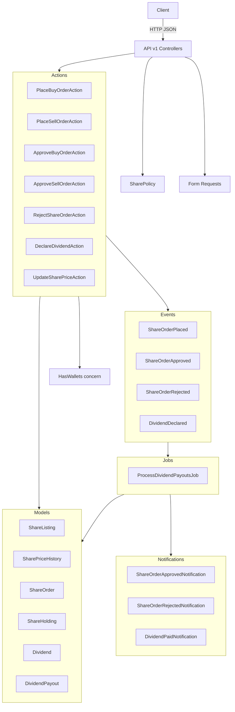

# Design Document: Website Shares System

## Overview

A backend website shares system built on Laravel 13 / PHP 8.4. Users submit buy and sell orders for shares at a published price; all orders require administrator approval before execution. Users cannot sell shares until a configurable holding period (default 30 days) has elapsed since acquisition. Dividends are periodically declared by administrators and distributed proportionally to eligible shareholders via a queued job. All monetary movements use the existing `HasWallets` concern, `Wallet` model, and `Transaction` model. The system follows the same architectural patterns as the loan management system: action classes, events, queued jobs, named notifications, form requests, and Eloquent API resources under `/api/v1/`.

---

## Architecture



### Request Lifecycle

1. Controller receives request, delegates to a Form Request for validation.
2. Controller authorizes via `SharePolicy` (returns 403 if unauthorized).
3. Controller calls the relevant Action class.
4. Action updates models, calls wallet methods if needed, and fires an event.
5. Queued jobs handle async work (dividend distribution); named notification classes are dispatched directly.
6. Controller returns an Eloquent API Resource.

---

## Components

### Action Classes

All actions live under `App\Actions\Shares\` and are single-purpose classes injected via the service container.

| Class | Responsibility |
|---|---|
| `PlaceBuyOrderAction` | Validates available shares, places wallet hold, creates `ShareOrder`, dispatches `ShareOrderPlaced` |
| `PlaceSellOrderAction` | Validates holding quantity and holding period, creates sell `ShareOrder`, dispatches `ShareOrderPlaced` |
| `ApproveBuyOrderAction` | Confirms hold transaction, creates/increments `ShareHolding`, decrements listing, transitions to `approved`, dispatches `ShareOrderApproved`, sends notification |
| `ApproveSellOrderAction` | Deposits proceeds to wallet, decrements holding, increments listing, transitions to `approved`, dispatches `ShareOrderApproved`, sends notification |
| `RejectShareOrderAction` | Voids hold transaction (buy only), stores `rejection_reason`, transitions to `rejected`, dispatches `ShareOrderRejected`, sends notification |
| `DeclareDividendAction` | Creates `Dividend` record, dispatches `DividendDeclared`, dispatches `ProcessDividendPayoutsJob` |
| `UpdateSharePriceAction` | Records `SharePriceHistory`, updates `ShareListing::price` |

### SharePolicy

```php
class SharePolicy
{
    public function approve(User $user, ShareOrder $order): bool;
    public function reject(User $user, ShareOrder $order): bool;
    public function declareDividend(User $user): bool;
    public function updatePrice(User $user): bool;
}
```

All admin-gated methods check `(bool) $user->is_admin`. Applied in every controller via `$this->authorize()`.

### ProcessDividendPayoutsJob

Queued job that:
1. Queries `ShareHolding` records where `quantity > 0` and `acquired_at <= now()->subDays(config('shares.holding_period_days'))`.
2. Calculates total eligible shares.
3. For each eligible holder: `payout = (holding->quantity / total_eligible) × dividend->total_amount`.
4. Calls `$user->deposit(payout, WalletType::General)`.
5. Creates a `DividendPayout` record with the `transaction_id`.
6. Sends `DividendPaidNotification` to the user.
7. Marks `Dividend::status = distributed`.

### Controllers

All controllers live under `App\Http\Controllers\Api\V1\Shares\`.

| Controller | Methods |
|---|---|
| `ShareListingController` | `show`, `update` |
| `ShareOrderController` | `index`, `show`, `buy`, `sell` |
| `ShareOrderApprovalController` | `store` |
| `ShareOrderRejectionController` | `store` |
| `ShareHoldingController` | `show` |
| `SharePriceHistoryController` | `index` |
| `DividendController` | `store` |
| `DividendPayoutController` | `index` |

### Routes

```php
// routes/api.php — added to existing auth:sanctum v1 group
Route::prefix('shares')->group(function () {
    Route::get('listing',              [ShareListingController::class, 'show']);
    Route::put('listing/price',        [ShareListingController::class, 'update']);

    Route::get('orders',               [ShareOrderController::class, 'index']);
    Route::get('orders/{order}',       [ShareOrderController::class, 'show']);
    Route::post('orders/buy',          [ShareOrderController::class, 'buy']);
    Route::post('orders/sell',         [ShareOrderController::class, 'sell']);
    Route::post('orders/{order}/approve', [ShareOrderApprovalController::class, 'store']);
    Route::post('orders/{order}/reject',  [ShareOrderRejectionController::class, 'store']);

    Route::get('holdings',             [ShareHoldingController::class, 'show']);
    Route::get('price-history',        [SharePriceHistoryController::class, 'index']);

    Route::post('dividends',           [DividendController::class, 'store']);
    Route::get('dividends/payouts',    [DividendPayoutController::class, 'index']);
});
```

### Form Requests

| Class | Rules |
|---|---|
| `StoreBuyOrderRequest` | `quantity`: required, integer, min:1 |
| `StoreSellOrderRequest` | `quantity`: required, integer, min:1 |
| `StoreShareOrderRejectionRequest` | `rejection_reason`: required, string |
| `StoreDividendRequest` | `total_amount`: required, numeric, min:0.01 |
| `UpdateSharePriceRequest` | `price`: required, numeric, min:0.01 |

### API Resources

| Class | Exposes |
|---|---|
| `ShareListingResource` | `id`, `price`, `total_shares`, `available_shares`, `updated_at` |
| `ShareOrderResource` | `id`, `user_id`, `type`, `quantity`, `price_per_share`, `total_amount`, `status`, `rejection_reason`, `created_at` |
| `ShareHoldingResource` | `quantity`, `acquired_at`, `market_value`, `eligible_for_sale` |
| `SharePriceHistoryResource` | `id`, `old_price`, `new_price`, `created_at` |
| `DividendPayoutResource` | `id`, `amount`, `created_at`, nested `dividend` (`total_amount`, `declared_at`) |

### Notifications

All live under `App\Notifications\Shares\`, implement `ShouldQueue`, use `Queueable`, and return `['database']` from `via()`.

| Class | Trigger |
|---|---|
| `ShareOrderApprovedNotification` | Order transitions to `approved` |
| `ShareOrderRejectedNotification` | Order transitions to `rejected` |
| `DividendPaidNotification` | Dividend payout credited to user |

---

## Data Models

### share_listings

| Column | Type | Notes |
|---|---|---|
| `id` | bigint PK | |
| `price` | decimal(15,2) | Current share price |
| `total_shares` | unsignedBigInteger | Total issued shares |
| `available_shares` | unsignedBigInteger | Shares available for purchase |
| `created_at` / `updated_at` | timestamps | |

### share_price_histories

| Column | Type | Notes |
|---|---|---|
| `id` | bigint PK | |
| `old_price` | decimal(15,2) | Price before change |
| `new_price` | decimal(15,2) | Price after change |
| `created_at` | timestamp | Change timestamp (no `updated_at`) |

### share_orders

| Column | Type | Notes |
|---|---|---|
| `id` | bigint PK | |
| `user_id` | bigint FK | `users.id` |
| `type` | string | `ShareOrderType` enum: `buy`, `sell` |
| `quantity` | unsignedBigInteger | Number of shares |
| `price_per_share` | decimal(15,2) | Price at time of order |
| `total_amount` | decimal(15,2) | `quantity × price_per_share` |
| `status` | string | `ShareOrderStatus` enum: `pending`, `approved`, `rejected`; default `pending` |
| `hold_transaction_id` | bigint FK nullable | `transactions.id` — the hold placed on buy order creation |
| `rejection_reason` | text nullable | Required when rejected |
| `created_at` / `updated_at` | timestamps | |

### share_holdings

| Column | Type | Notes |
|---|---|---|
| `id` | bigint PK | |
| `user_id` | bigint FK unique | `users.id` — one holding record per user |
| `quantity` | unsignedBigInteger | Current shares owned; default 0 |
| `acquired_at` | timestamp nullable | Timestamp of first/most recent acquisition; used for holding period |
| `created_at` / `updated_at` | timestamps | |

### dividends

| Column | Type | Notes |
|---|---|---|
| `id` | bigint PK | |
| `total_amount` | decimal(15,2) | Total declared dividend amount |
| `status` | string | `DividendStatus` enum: `pending`, `distributed`; default `pending` |
| `declared_at` | timestamp | When the dividend was declared |
| `created_at` / `updated_at` | timestamps | |

### dividend_payouts

| Column | Type | Notes |
|---|---|---|
| `id` | bigint PK | |
| `dividend_id` | bigint FK | `dividends.id` cascadeOnDelete |
| `user_id` | bigint FK | `users.id` |
| `amount` | decimal(15,2) | Proportional payout amount |
| `transaction_id` | bigint FK nullable | `transactions.id` — the deposit transaction |
| `created_at` / `updated_at` | timestamps | |

### Eloquent Models

```
App\Models\ShareListing
App\Models\SharePriceHistory
App\Models\ShareOrder
App\Models\ShareHolding
App\Models\Dividend
App\Models\DividendPayout
```

**ShareOrder** has:
- `belongsTo(User::class)`
- `belongsTo(Transaction::class, 'hold_transaction_id')` — aliased as `holdTransaction()`
- `ShareOrderStatus` enum cast on `status`
- `ShareOrderType` enum cast on `type`

**ShareHolding** has:
- `belongsTo(User::class)`
- `acquired_at` cast to `datetime`

**Dividend** has:
- `hasMany(DividendPayout::class)`
- `DividendStatus` enum cast on `status`
- `declared_at` cast to `datetime`

**DividendPayout** has:
- `belongsTo(Dividend::class)`
- `belongsTo(User::class)`
- `belongsTo(Transaction::class)`

**User** gains:
- `hasOne(ShareHolding::class)`
- `hasMany(ShareOrder::class)`
- `hasMany(DividendPayout::class)`

### Enums

```php
enum ShareOrderStatus: string
{
    case Pending  = 'pending';
    case Approved = 'approved';
    case Rejected = 'rejected';
}

enum ShareOrderType: string
{
    case Buy  = 'buy';
    case Sell = 'sell';
}

enum DividendStatus: string
{
    case Pending     = 'pending';
    case Distributed = 'distributed';
}
```

---

## Wallet Integration

The system uses the existing `HasWallets` concern on `User` without modification:

| Operation | Method | When |
|---|---|---|
| Buy order placed | `$user->hold(total_amount, WalletType::General)` | `PlaceBuyOrderAction` |
| Buy order approved | `$holdTransaction->confirm()` | `ApproveBuyOrderAction` |
| Buy order rejected | `$holdTransaction->void()` | `RejectShareOrderAction` |
| Sell order approved | `$user->deposit(proceeds, WalletType::General)` | `ApproveSellOrderAction` |
| Dividend payout | `$user->deposit(payout_amount, WalletType::General)` | `ProcessDividendPayoutsJob` |

The `Transaction` model's `confirm()` method debits `balance` and releases `held_balance`. The `void()` method only releases `held_balance`. Both are already implemented.

---

## Holding Period Logic

```
eligible_for_sale = acquired_at <= now()->subDays(config('shares.holding_period_days'))
earliest_sell_date = acquired_at->addDays(config('shares.holding_period_days'))
```

`PlaceSellOrderAction` checks this before creating the order. `HoldingPeriodNotMetException` carries the `earliest_sell_date` for the 422 response.

`ShareHoldingResource` exposes `eligible_for_sale` as a computed boolean.

---

## Dividend Distribution Formula

```
total_eligible_shares = sum of quantity for all eligible ShareHolding records
payout_for_user       = (user_holding->quantity / total_eligible_shares) × dividend->total_amount
```

Rounded to 2 decimal places per user. If `total_eligible_shares = 0`, the dividend is marked `distributed` immediately with no payouts.

---

## Error Handling

### Exception Renderers (bootstrap/app.php)

| Exception | HTTP Status | Response |
|---|---|---|
| `InvalidShareOrderStateException` | 422 | `{'message': $e->getMessage()}` |
| `InsufficientSharesException` | 422 | `{'message': $e->getMessage()}` |
| `HoldingPeriodNotMetException` | 422 | `{'message': ..., 'earliest_sell_date': $e->getEarliestSellDate()}` |
| `InsufficientAvailableSharesException` | 422 | `{'message': $e->getMessage()}` |
| `InsufficientFundsException` (existing) | 422 | Already registered |

### Validation Errors

Form Requests return 422 automatically. All messages use the standard `{ errors: { field: [...] } }` envelope.

### Not Found / Authorization

`ShareOrderController::show` returns 404 if the order does not belong to the authenticated user. Unauthorized policy checks return 403.

---

## Correctness Properties

### Property 1: Buy order creates pending order and wallet hold

*For any* authenticated user with sufficient wallet balance and available shares, submitting a buy order SHALL create a `ShareOrder` with `status = pending` and `type = buy`, and SHALL place a hold on the user's General wallet equal to `quantity × current_price`.

**Validates: Requirements 2.1, 2.2, 2.3**

---

### Property 2: Sell order enforces holding period

*For any* user whose `ShareHolding::acquired_at` is less than `holding_period_days` days ago, submitting a sell order SHALL return HTTP 422 with the earliest permitted sell date.

**Validates: Requirements 3.3, 7.3, 7.4**

---

### Property 3: Buy order approval confirms hold and creates holding

*For any* pending buy order, approving it SHALL confirm the hold transaction (debit wallet), create or increment the user's `ShareHolding`, and decrement `ShareListing::available_shares` by the purchased quantity.

**Validates: Requirements 4.2, 4.3, 4.4**

---

### Property 4: Sell order approval credits wallet and decrements holding

*For any* pending sell order, approving it SHALL deposit `quantity × price_per_share` to the user's General wallet and decrement the user's `ShareHolding::quantity` by the sold amount.

**Validates: Requirements 5.2, 5.3**

---

### Property 5: Order rejection voids hold for buy orders

*For any* pending buy order, rejecting it SHALL void the associated hold transaction, releasing the reserved funds back to the user's available balance.

**Validates: Requirements 6.2, 13.3**

---

### Property 6: Order status transitions are enforced

*For any* `ShareOrder`, approving or rejecting a non-pending order SHALL return HTTP 422.

**Validates: Requirements 4.7, 5.8, 6.5**

---

### Property 7: Dividend distributes proportionally to eligible holders

*For any* declared dividend with total amount D and N eligible shareholders with quantities q₁…qN, each user i SHALL receive `(qᵢ / Σq) × D`, and the sum of all payouts SHALL equal D (within rounding tolerance).

**Validates: Requirements 11.3, 11.4, 11.5**

---

### Property 8: Users only see their own orders

*For any* two users A and B, user A's order list SHALL not contain orders belonging to user B, and requesting a specific order belonging to user B as user A SHALL return HTTP 404.

**Validates: Requirements 9.1, 9.4**

---

## Testing Strategy

### Test Organisation

```
tests/
  Feature/
    Shares/
      BuyOrderTest.php          # Properties 1, 6
      SellOrderTest.php         # Properties 2, 6
      OrderApprovalTest.php     # Properties 3, 4, 6
      OrderRejectionTest.php    # Properties 5, 6
      HoldingsAndListingTest.php
      DividendTest.php          # Property 7
      OrderHistoryTest.php      # Property 8
  Arch/
    SharesTest.php
```

### Feature Testing Focus

- Full HTTP request/response cycle using `actingAs()` and model factories
- `Event::fake()` for event dispatch assertions
- `Bus::fake()` for job dispatch assertions
- `Notification::fake()` for notification assertions
- `LazilyRefreshDatabase` on all feature tests
- Admin actions tested with `$user->is_admin = true`

### Architecture Tests

```php
arch('share actions have Action suffix')
    ->expect('App\Actions\Shares')
    ->toHaveSuffix('Action');

arch('share notifications implement ShouldQueue')
    ->expect('App\Notifications\Shares')
    ->toImplement(ShouldQueue::class);
```
